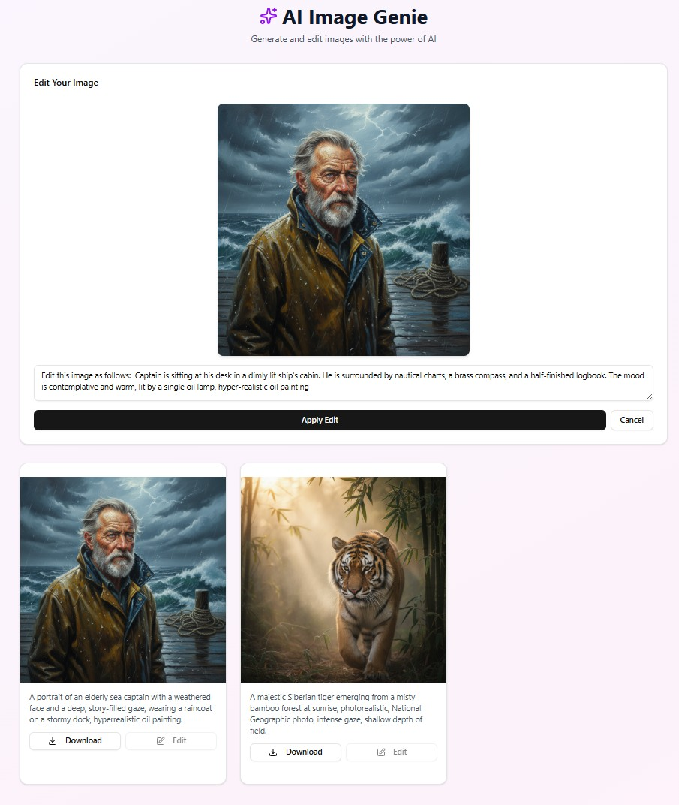

## AI Image Genie
Image generation and editing app developed in Next JS. For details of app functionalty, read the PRD document in \PRD folder.

## Technologies Used:

  Frontend Technologies:

  - Next.js 15.5.2 - React framework with server-side rendering
  - React 19.1.0 - UI library
  - React DOM 19.1.0 - React DOM rendering
  - TypeScript 5 - Type-safe JavaScript

  Backend/API Technologies:

  - Next.js API Routes - Serverless functions (app/api routes)
  - Axios 1.11.0 - HTTP client for API calls
  - n8n 1.106.3 -- Workflow to generate and edit images using Googles Image Generation model (Nano Banana)

## Screenshots

